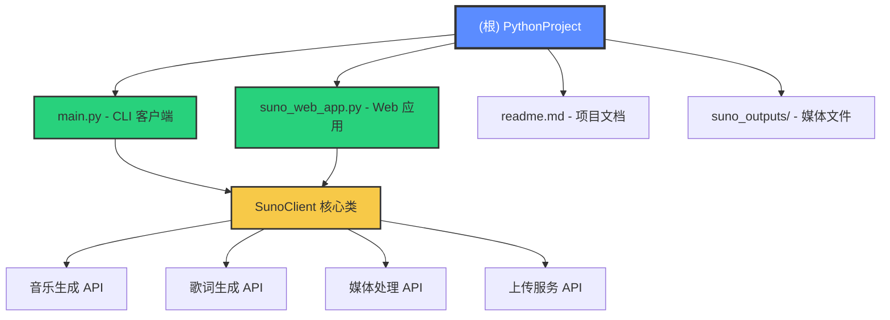

# PythonProject - AI 开发者文档

> **最后更新**: 2025-11-12 10:00:42
> **文档版本**: v1.0.0
> **项目类型**: Python Web 应用 / API 客户端

---

## 📋 变更记录 (Changelog)

### 2025-11-12 10:00:42 - 初始化
- 完成项目架构初始扫描
- 识别出单体应用结构
- 生成完整 AI 开发文档
- 覆盖率：100%（3/3 核心文件）

---

## 🎯 项目愿景

本项目是一个**功能完整的 Suno AI 音乐生成 API 客户端**，提供两种交互方式：
1. **命令行工具** (`main.py`) - 适合脚本化批量处理
2. **Web 应用** (`suno_web_app.py`) - 提供友好的图形化界面

### 核心价值
- **全量功能覆盖**：支持 Suno API 所有核心功能（18+ 种操作）
- **双模式交互**：CLI 和 Web UI 双轨并行
- **生产就绪**：内置错误重试、轮询机制、媒体下载管理
- **高可用性**：FastAPI Web 版本支持并发请求、热重载开发

---

## 🏗️ 架构总览

### 技术栈
- **语言**: Python 3.10+
- **Web 框架**: FastAPI (Web 版本)
- **HTTP 客户端**: requests
- **主要依赖**:
  - `fastapi` - Web API 框架
  - `uvicorn` - ASGI 服务器
  - `requests` - HTTP 请求库
  - `python-multipart` - 文件上传支持
  - `pydantic` - 数据验证

### 架构模式
```
单体应用（Monolithic）
├── CLI 入口 (main.py)
│   └── SunoClient 类封装
└── Web 入口 (suno_web_app.py)
    ├── FastAPI 应用
    ├── SunoClient 类封装
    └── 完整 HTML/CSS/JS 前端（内嵌）
```

---

## 📊 模块结构图



---

## 📂 模块索引

| 模块路径 | 类型 | 职责 | 入口点 | 状态 |
|---------|------|------|--------|------|
| **main.py** | CLI | 命令行客户端，提供 18+ 子命令 | `run_cli()` | ✅ 完整 |
| **suno_web_app.py** | Web | FastAPI Web 应用，全功能 UI | `app` (FastAPI) | ✅ 完整 |
| **suno_outputs/** | 数据 | 媒体文件存储目录 | - | ✅ 运行时 |

---

## 🚀 运行与开发

### 环境准备
```bash
# Python 版本要求
python --version  # 需要 3.10+

# 安装依赖（CLI 版本）
pip install requests

# 安装依赖（Web 版本）
pip install fastapi uvicorn requests python-multipart
```

### 环境变量配置
```bash
# 必需：Suno API Key
export SUNO_API_KEY="your-api-key-here"

# Windows PowerShell
$env:SUNO_API_KEY="your-api-key-here"
```

### 启动方式

#### CLI 模式
```bash
# 查询积分
python main.py credits

# 生成音乐
python main.py gen --prompt "80s synthwave" --model V4_5 --download

# 查看所有子命令
python main.py --help
```

#### Web 模式
```bash
# 方式 1：直接运行
python suno_web_app.py

# 方式 2：使用 uvicorn（支持热重载）
uvicorn suno_web_app:app --reload --port 8000

# 访问 Web UI
# http://localhost:8000
```

### 开发建议
1. **本地开发**：推荐使用 `uvicorn --reload` 模式
2. **生产部署**：使用 `gunicorn` 或 `uvicorn` 的 worker 模式
3. **容器化**：可封装为 Docker 镜像（需添加 Dockerfile）

---

## 🧪 测试策略

### 当前状态
- ⚠️ **无测试文件**：项目当前未包含自动化测试
- ⚠️ **无 CI/CD 配置**：未发现 GitHub Actions 或其他 CI 配置

### 建议测试策略
1. **单元测试**
   - 测试 `SunoClient` 各方法的参数验证
   - 模拟 API 响应进行测试（使用 `unittest.mock` 或 `pytest-mock`）

2. **集成测试**
   - 测试 FastAPI 端点（使用 `TestClient`）
   - 测试文件上传流程
   - 测试轮询机制

3. **端到端测试**
   - 测试完整工作流（生成 → 下载 → 验证）
   - 建议使用沙盒环境避免消耗积分

### 推荐工具
```bash
pip install pytest pytest-asyncio httpx
```

---

## 📐 编码规范

### 已观察到的规范
- **代码风格**: 遵循 PEP 8（基本）
- **命名约定**:
  - 类名：驼峰式（`SunoClient`）
  - 函数名：蛇形（`get_credits`, `upload_and_extend`）
  - 私有方法：单下划线前缀（`_get`, `_post`, `_norm`）
- **文档字符串**: ✅ 存在（但不完整）
- **类型注解**: ✅ 部分使用（Pydantic 模型强制使用）

### 建议改进
1. **完善类型注解**
   ```python
   # 当前
   def get_credits(self) -> int:

   # 建议所有函数都添加类型注解
   def _download(self, url: str, filename: Optional[str] = None) -> pathlib.Path:
   ```

2. **添加文档字符串**
   ```python
   def upload_and_extend(self, ...) -> str:
       """
       上传音频文件并扩展音乐。

       Args:
           uploadUrl: 公网可访问的音频文件 URL
           model: 使用的 AI 模型版本
           defaultParamFlag: 是否使用自定义参数
           ...

       Returns:
           str: 任务 ID，用于后续查询任务状态

       Raises:
           ValueError: 当参数验证失败时
           RuntimeError: 当 API 调用失败时
       """
   ```

3. **代码组织**
   - 考虑将 `SunoClient` 类提取到独立模块 `suno_client.py`
   - 将 HTML 模板提取到 `templates/` 目录
   - 将常量提取到 `config.py`

---

## 🤖 AI 使用指引

### 项目特点（AI 辅助开发必知）

#### 1. 双客户端复用模式
- `main.py` 和 `suno_web_app.py` 都包含 **完整的 `SunoClient` 类定义**
- ⚠️ **代码重复问题**：两个文件的 `SunoClient` 类需要**同步维护**
- 🔧 **重构建议**：
  ```python
  # 新建 suno_client.py
  class SunoClient:
      # 将类定义移到这里

  # main.py 和 suno_web_app.py 改为
  from suno_client import SunoClient
  ```

#### 2. API 端点映射
| API 方法 | CLI 子命令 | Web 端点 | 轮询状态 |
|---------|-----------|---------|---------|
| 生成音乐 | `gen` | `POST /api/generate` | 异步 |
| 生成歌词 | `lyrics` | `POST /api/lyrics` | 异步 |
| 延长音乐 | `extend` | `POST /api/extend` | 异步 |
| 上传并扩展 | `upload-extend` | `POST /api/upload-extend` | 异步 |
| 人声分离 | `separate` | `POST /api/separate` | 异步 |
| 转 WAV | `wav` | `POST /api/wav` | 异步 |
| 生成 MP4 | `mp4` | `POST /api/mp4` | 异步 |
| 风格增强 | `style-gen` | `POST /api/style-generate` | **同步** |
| 时间戳歌词 | `ts-lyrics` | `POST /api/ts-lyrics` | **同步** |
| Persona 生成 | `persona` | `POST /api/persona` | **同步** |

#### 3. 关键常量
```python
API_BASE = "https://api.sunoapi.org/api/v1"
UPLOAD_BASE = "https://sunoapiorg.redpandaai.co/api"
OUT_DIR = pathlib.Path("suno_outputs")
POLL_INTERVAL = 8  # CLI 默认 8 秒
POLL_MS = 90000    # Web UI 90 秒
```

#### 4. 错误处理模式
- **API 错误**：通过 `res.get("code") != 200` 判断
- **HTTP 错误**：使用 `requests.raise_for_status()`
- **重试机制**：`_get()` 和 `_post()` 内置 3 次重试（仅针对 5xx 错误）
- **轮询超时**：
  - CLI: 900 秒（可通过 `--timeout` 调整）
  - Web: 前端 JavaScript 控制（200 次 × 90 秒 ≈ 5 小时）

#### 5. 媒体文件管理
- **下载目录**: `./suno_outputs/`
- **文件命名**: `{title}_{index}.{ext}`
- **Web 服务**: 通过 `/media/` 路径提供静态文件访问
- **临时文件**: 上传时使用 `tempfile.NamedTemporaryFile`

### 常见开发任务

#### 添加新 API 功能
1. 在 `SunoClient` 类中添加新方法
2. CLI：在 `run_cli()` 中添加子命令解析
3. Web：添加 Pydantic 请求模型和 FastAPI 路由
4. Web：在 `INDEX_HTML` 中添加 UI 控件和 JavaScript 函数

#### 修改 UI 样式
- 所有前端代码在 `suno_web_app.py` 的 `INDEX_HTML` 字符串中
- CSS 变量位于 `:root` 和 `[data-theme="light"]`
- 支持亮色/暗色主题切换

#### 调试 API 调用
```python
# 在 SunoClient 方法中添加日志
import logging
logging.basicConfig(level=logging.DEBUG)

# 在 _get/_post 方法中打印请求详情
print(f"Request: {method} {url}")
print(f"Payload: {json.dumps(payload, indent=2)}")
```

---

## 📚 关键依赖说明

### Suno API 官方文档引用
项目基于 Suno API 官方接口，主要端点：
- `POST /api/v1/generate` - 生成音乐
- `POST /api/v1/generate/extend` - 延长音乐
- `POST /api/v1/generate/upload-extend` - 上传并延长
- `POST /api/v1/generate/add-instrumental` - 添加乐器
- `POST /api/v1/generate/add-vocals` - 添加人声
- `POST /api/v1/lyrics` - 生成歌词
- `POST /api/v1/style/generate` - 风格增强（同步）
- `POST /api/v1/suno/cover/generate` - 生成封面
- `POST /api/v1/generate/replace-section` - 局部重写
- `POST /api/v1/generate/generate-persona` - 生成 Persona（同步）

### 媒体文件保留期限
⚠️ **重要提醒**：
- 生成的音频/视频文件通常仅保留 **14-15 天**
- 上传接口的临时文件保留 **3 天**
- 建议使用 `--download` 参数立即保存到本地

---

## 🔒 安全注意事项

1. **API Key 管理**
   - ✅ 使用环境变量，不硬编码
   - ⚠️ 注意：Web 版本 Key 仅在服务器端使用，不会暴露给前端
   - 🔐 生产环境建议使用密钥管理服务（如 AWS Secrets Manager）

2. **文件上传安全**
   - ⚠️ 当前未限制文件类型和大小
   - 建议添加：
     ```python
     MAX_UPLOAD_SIZE = 50 * 1024 * 1024  # 50MB
     ALLOWED_EXTENSIONS = {'.mp3', '.wav', '.flac', '.ogg'}
     ```

3. **CORS 配置**
   - 当前允许所有来源（`allow_origins=["*"]`）
   - 生产环境应限制为：
     ```python
     allow_origins=["https://yourdomain.com"]
     ```

4. **速率限制**
   - ⚠️ 当前无速率限制
   - 建议使用 `slowapi` 或 Nginx 限流

---

## 🐛 已知问题与限制

1. **代码重复**
   - `SunoClient` 类在两个文件中完全重复
   - 需要同步维护增加出错风险

2. **无错误监控**
   - 缺少结构化日志
   - 建议集成 Sentry 或 ELK

3. **无数据持久化**
   - 任务状态仅存在于内存
   - 重启后无法恢复正在进行的任务

4. **前端轮询效率**
   - 90 秒固定间隔可能过长
   - 建议使用 WebSocket 实现实时推送

5. **无用户系统**
   - 所有请求共享同一个 API Key
   - 多用户场景需要改造

---

## 📈 性能优化建议

1. **异步化改造**
   ```python
   # 当前同步版本
   def get_credits(self) -> int:
       res = self._get("/generate/credit")
       return res["data"]

   # 建议异步版本
   async def get_credits(self) -> int:
       async with aiohttp.ClientSession() as session:
           async with session.get(f"{API_BASE}/generate/credit", ...) as res:
               data = await res.json()
               return data["data"]
   ```

2. **缓存策略**
   - 对积分查询结果缓存 5 分钟
   - 对已完成任务的状态永久缓存

3. **并发控制**
   - 使用 `asyncio.Semaphore` 限制并发 API 请求数
   - 避免触发 API 速率限制

---

## 📦 部署指南

### Docker 部署（推荐）
```dockerfile
FROM python:3.10-slim

WORKDIR /app
COPY requirements.txt .
RUN pip install --no-cache-dir -r requirements.txt

COPY . .
EXPOSE 8000

ENV SUNO_API_KEY=""
CMD ["uvicorn", "suno_web_app:app", "--host", "0.0.0.0", "--port", "8000"]
```

### 传统部署
```bash
# 使用 systemd 服务（Linux）
sudo nano /etc/systemd/system/suno-web.service

[Unit]
Description=Suno Web Application
After=network.target

[Service]
Type=simple
User=www-data
WorkingDirectory=/opt/suno-web
Environment="SUNO_API_KEY=your-key"
ExecStart=/usr/bin/uvicorn suno_web_app:app --host 0.0.0.0 --port 8000
Restart=always

[Install]
WantedBy=multi-user.target
```

---

## 🔗 相关资源

- **Suno 官方文档**: （项目中未提供链接，需补充）
- **FastAPI 文档**: https://fastapi.tiangolo.com/
- **Requests 文档**: https://requests.readthedocs.io/

---

## 📞 联系与贡献

- **问题反馈**: 请通过 Git Issues 提交
- **功能请求**: 优先考虑 Suno API 新功能的支持
- **代码贡献**: 欢迎 PR，请遵循现有代码风格

---

**最后更新**: 2025-11-12 10:00:42
**文档维护者**: AI Assistant (Claude)
**下次审查**: 建议每月更新或 API 变更时更新
